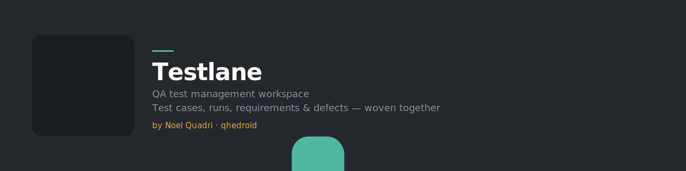

<div align="center">
  
</div>

<div align="center">


</div>

## Testlane

A QA test management workspace — test cases, test runs, test plans,
requirements, and defects, woven into one workflow instead of scattered
across a spreadsheet and a bug tracker.

Built as a full-stack, from-scratch project: a Next.js App Router frontend,
a real MySQL/Drizzle backend, role-based access control, and an audited admin
panel. Started as a frontend-only prototype over local storage, then rebuilt
module by module onto a real database and API layer.

---

## What it does

- **Test cases** — organise cases into folders, tag them, track history, and
  link them to requirements they verify.
- **Test runs** — execute a plan against a project, record pass/fail/blocked
  results per case, and see run history at a glance.
- **Test plans** — group cases into a run-ready set for a release or a cycle.
- **Requirements** — create and link requirements to the test cases that
  cover them, so coverage isn't guesswork.
- **Defects** — raise and link a defect straight from a failed or blocked run
  result, with traceability back to the case and run that caught it.
- **Admin panel** — manage users, roles, and API-key settings, with project-
  scoped RBAC enforced at the service layer and an audited activity trail.

## What's still a work in progress

Built as a portfolio project, so some areas are intentionally further along
than others: reporting, the AI-assisted test authoring studio, My Work, and
Milestones are visual shells. The core case/run/plan workflow is real and
wired to the database; Requirements and Defects have real APIs but retain
demo fallbacks while their seed data is empty.

## Tech stack

- **Frontend**: Next.js 15 App Router, React 19, authored CSS
- **Backend**: Next.js API routes, Drizzle ORM, MySQL 8
- **Auth**: NextAuth.js (credentials + JWT sessions)
- **Tooling**: pnpm workspaces, Docker Compose

## Running it locally

Requirements: Node.js 20+, pnpm 9+, Docker Desktop, and Git.

```bash
git clone https://github.com/qhedroid/testlane.git
cd testlane
pnpm install
cp .env.example .env
pnpm docker:up
pnpm db:migrate
pnpm db:seed
pnpm dev
```

Open `http://localhost:3000`. The app redirects to `/login`; the seed command
prints the demo account emails. All seeded users share the local-only password
`testlane-demo-2026`.

Build and API validation:

```bash
pnpm build
pnpm api:validate   # requires the database and dev server
```

## Author

Built by **Noel Quadri** ([@qhedroid](https://github.com/qhedroid)) —
Solutions Engineer, Cloud & DevOps, London, UK.

[LinkedIn](https://www.linkedin.com/in/noelquadri2001) ·
[GitHub](https://github.com/qhedroid)
