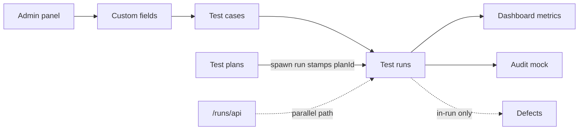

# Testlane — Feature Flow Map

*Living document · Last verified: 13 July 2026 · Branch: `mvp-backend`*

Product and implementation flow map for the team. Complements authoritative contracts in `docs/_authoritative/**` with journey-oriented status and test checklists.

**For developers and agents:** Update this file whenever routes, module status, persistence, or user journeys change. Pair with [`user-guide.md`](user-guide.md).

---

## Modules and routes

**Canonical pattern:** `/:projectKey/:moduleSlug` — project key is uppercase in URLs (e.g. `DP`, `CTMS`).

| Module | Slug | Screen component | Route(s) | Data state |
|--------|------|------------------|----------|------------|
| Dashboard | `dashboard` | `DashboardScreen` | `/:key/dashboard` | Computed client-side from **API-synced** FreshProvider state |
| My Work | `mywork` | `MyWorkScreen` | `/:key/mywork` | Static demo content |
| Test cases | `testcases` | `CasesScreen` | `/:key/testcases`, `/:key/testcases/tc/:caseKey` | **API / MySQL** — incl. comments (general + per-step) and requirement links (+ local-only: custom fields) |
| Test plans | `plans` | `PlansScreen` | `/:key/plans` | **API / MySQL** — incl. query definitions (`test_plans.query_definition`) + resolved case lists |
| Test runs | `testruns` | `RunsScreen` | `/:key/testruns`, `/:key/testruns/tr/:runKey`, `/:key/testruns/tr/:runKey/tc/:caseKey` | **API / MySQL** — incl. per-step results, run descriptions, execution history; plan-spawned AND ad-hoc runs |
| Milestones | `milestones` | `MilestonesScreen` | `/:key/milestones` | Static demo content |
| Requirements | `requirements` | `RequirementsScreen` | `/:key/requirements` | **API / MySQL** (`requirements` table); static demo list fallback when none seeded |
| Defects | `defects` | `DefectsScreen` | `/:key/defects` | **API / MySQL** (`defects` table + run↔defect links); static mock fallback when none seeded |
| Reports | `reports` | `ReportsScreen` | `/:key/reports` | Static demo content |
| AI Studio | `aistudio` | `AiStudioScreen` | `/:key/aistudio` | Static demo content (no real AI) |
| Settings | `settings` | redirect → `/admin` | `/:key/settings` | Redirect only (legacy route) |
| Integrations | `integrations` | `PlaceholderScreen` | `/:key/integrations` | Placeholder |
| Audit | `audit` | `AuditScreen` | `/:key/audit` | **API / MySQL** for real projects (screen-level fetch); static seed for local |
| Login | — | `LoginScreen` | `/login` (top-level; `/:key/login` redirects here) | **Real auth gate** — NextAuth Credentials, JWT session |
| Admin | — | `AdminShell` + page content | `/admin`, `/admin/profile` … `/admin/audit-log` | Users, role definitions, API keys: **API / MySQL** (global-admin sessions); automation + custom fields mock + localStorage |
| API runs | — | `ApiRunsWorkspace` | `/runs/api` | **API / MySQL** |

**Legacy unprefixed redirects** (`LegacyRouteRedirect`): `/dashboard`, `/cases`, `/runs`, `/plans`, etc. → `/:activeProjectKey/<module>`.

**Auth gate:** `apps/web/src/middleware.ts` requires a valid NextAuth session for every route except `/login`, `/api/auth/*`, `/api/runs/*`, `/api/health`, `/_next/*`, `/fonts/*`. Logged-out visits redirect to `/login?callbackUrl=<original path>`.

**Root:** `/` → default project dashboard (`/DP/dashboard` once real projects register; the richly-seeded Demo Project, slug `dp`, is the default landing project).

**Exceptions:** `/runs/api`, `/api/*` — not project-prefixed.

**Route helpers:** `apps/web/src/fresh/lib/project-routes.ts`  
**Machine-readable metadata:** `apps/web/src/lib/relay/prototype-contracts.ts`

**Known route gap:** `/:key/cases` → **404** (slug renamed to `testcases`; unprefixed `/cases` still redirects).

---

## Main user journeys

### 1. First-time demo (no Docker)

```
/ → /DP/dashboard → browse testcases → open testruns/tr/00001 → execute case → seal run
```

### 2. Create and execute a new run

```
/:key/testcases (optional: select cases)
  → Create test run OR /:key/testruns → Create run modal
  → /:key/testruns/tr/:runKey
  → + Add cases (if empty)
  → select case → mark step/case results
  → Close test run (seal)
```

### 3. Manage test library

```
/:key/testcases
  → folder navigation → quick create / new case modal
  → row ⋯ menu (duplicate, edit, delete)
  → detail panel edit → persists localStorage
```

### 4. Multi-project workflow

```
ProjectSwitcher → select / create / add demo project
  → URL rewrites (/:oldKey/module → /:newKey/module)
  → scoped folders, cases, runs per project
```

### 5. Admin configuration

```
/admin/projects → select project → activate custom fields
/admin/custom-fields → define fields globally (localStorage)
/admin/users → invite user (MySQL, global-admin sessions)
/admin/roles → create/edit role definitions (MySQL, global-admin sessions)
Changes append to /admin/audit-log
```

### 6. API validation path (backend slice)

```
pnpm docker:up && pnpm db:migrate && pnpm db:seed
→ /runs/api → create run → update case result
→ pnpm api:validate
```

`/DP/testruns` and `/runs/api` both run against the real backend now; `/runs/api` keeps its `x-relay-user-id` dev-header fallback (session wins when logged in) so `pnpm api:validate` still works.

---

## Data persistence model

| Layer | Mechanism | Scope |
|-------|-----------|-------|
| Source of truth | **MySQL via the real API** (`/api/projects/*`, `/api/runs/*`, `/api/users/*`, `/api/admin/*`) | Projects, folders, cases (+ comments + requirement links), plans (+ query definitions + case lists), runs (+ case/step results + descriptions + execution events), requirements, defects, audit log, users, role definitions, API keys |
| UI state | `FreshProvider` + `useReducer`, **synced from the API** for real projects (`SYNC_REAL_PROJECT_DATA` on project activation; **wait-for-server** write-through on mutations, except optimistic P/F/B/S result recording with rollback) | In-memory React state |
| Browser persistence | `localStorage` key **`testlane-demo-v2`** | Cache of synced data + store for the remaining **local-only fields** (custom-field definitions/values, admin automation, the "Demo User" actor + mock admin roster fallback) |
| DB seed | `packages/db/src/seed/` (`pnpm db:seed`) — 7 projects incl. the richly-seeded **Demo Project** | Real rows; full reset on re-run (wipes clones) |
| Static mock | `mock-data.ts`, seed arrays | Defects TI-* rows, static shells (My Work, Milestones, Reports, AI Studio) |

**Active project sync:** `ProjectRouteSync` reads URL project key → `setActiveProject` (held until real projects register, avoiding redirect flicker). Switcher writes URL + state together.

---

## localStorage schema notes

| Field | Value |
|-------|-------|
| Key | `testlane-demo-v2` |
| Current version | **`14`** (`DEMO_SCHEMA_VERSION` in `demo-model.ts`) |
| Migration file | `migrate-demo-state.ts` |
| On failure | Reset to seed (`buildInitialDemoState()`) |

### Version history (summary)

| Ver | Change |
|-----|--------|
| v2 | Multi-project blob |
| v3 | Required project `key`, Demo Project / `DP` |
| v4 | `runKey`, URL `/testruns/tr/:runKey` |
| v5 | `adminSettings` (global admin panel) |
| v6 | `Project.activeCustomFieldIds` |
| v7 | Case `template`, `references`, `summary`, `customFieldValues` |
| v8 | `Case.caseKey`, `nextCaseNumByProject` |
| v9 | Globally unique case ids (`newId('case')`) |
| v10 | `executionLog`, execution metadata on runs |
| v11 | `Case.createdAt` |
| v12 | `currentActorUserId`, user access fields, role permissions, silent invite statuses |
| v13 | `plansById`, `nextPlanNumByProject`, `TestPlan`/`TestQuery`/`QueryCondition` types, seed plans |
| v14 | `requirementsById`, `defectsById`, `Case.requirementIds`, `nextRequirementNumByProject`, `nextDefectNumByProject`, local REQ/DEF keys |

**Rule:** bump `DEMO_SCHEMA_VERSION` and add a migration step for every shape change.

**Key state fields:** `projectsById`, `activeProjectId`, `folders`, `cases`, `runs`, `currentRunIdByProject`, `nextRunNumByProject`, `nextCaseNumByProject`, `adminSettings`, `currentActorUserId`, `plansById`, `nextPlanNumByProject`, `requirementsById`, `defectsById`, `nextRequirementNumByProject`, `nextDefectNumByProject`.

Detail: [`docs/_authoritative/DOMAIN_MODEL.md`](../_authoritative/DOMAIN_MODEL.md), [`docs/claude/handoff.md`](../claude/handoff.md).

---

## Role / RBAC behaviour

### Target (backend — documented, not enforced in demo UI)

| Role | Capability (summary) |
|------|------------------------|
| `super_admin` | Platform-wide management |
| `admin` | Project management, seal/reopen runs |
| `contributor` | Execute runs, edit cases |
| `viewer` | Read-only |

Project-level override: `MAX(global_role, project_role)`.

Source: [`docs/_authoritative/ARCHITECTURE_BASELINE.md`](../_authoritative/ARCHITECTURE_BASELINE.md) § RBAC.

### Today (`mvp-backend`)

| Area | Behaviour |
|------|-----------|
| All `/api/projects/*`, `/api/users/*` routes | **Real session auth** (`resolveSessionActor`) + real RBAC (`assertMinProjectRole()` / global-admin checks) enforced server-side on every read and write |
| `/api/runs/*` | **Session-first** auth with `x-relay-user-id` dev-header fallback (kept for `pnpm api:validate`); service-layer RBAC on mutations |
| Admin users UI | Wired to `/api/users/*` for global-admin sessions (list/invite/role/disable); viewer sessions get a 403 and fall back to the local mock roster. Granular roles compress onto `globalRole` on writes |
| Screens (UI layer) | No client-side role gates — the server rejects unauthorized writes (403); writes wait for the server and surface failures as dismissible error toasts (P/F/B/S is the one optimistic path, with rollback) |
| Seal / reopen run | UI toggle; server enforces contributor+ |

---

## Feature status table

| Module / feature | Status | Persistence | Notes |
|------------------|--------|-------------|-------|
| Login / session gate | **Implemented** | MySQL (`users.password_hash`) + JWT cookie | NextAuth Credentials provider, JWT session strategy; `middleware.ts` gates all pages/most API routes; sign-out via top-bar `UserMenu` |
| User + Project API (`/api/users/*`, `/api/projects/*`) | **Implemented** | MySQL | `UserService`/`ProjectService`; real RBAC; called by the project picker + Admin users |
| Shell & navigation | **Implemented** | Client | Sidebar (Testing/Traceability groups), global top bar (New test case/run, AI Studio, Notifications, Help), Cmd+K |
| Project switcher | **Implemented** | MySQL | Real DB projects; "Create Demo Project" deep-clones the seeded Demo Project via API; rename/delete hidden for real projects |
| Dashboard | **Implemented** | MySQL (`GET /api/projects/:id/dashboard` KPIs; richer widgets computed client-side) | KPI strip, donut, trend chart, assignee bars, open runs, needs attention; week-over-week deltas + trends now driven by real `run_case_events` for synced runs |
| Test cases — tree & table & CRUD | **Implemented** | MySQL | Full CRUD wired; `TC-<n>` refs; delete = archive; comments + requirement links MySQL too; only custom fields local-only |
| Test cases — comments (general + per-step) | **Implemented** | MySQL (`case_comments`) | Write-through on add; author = session actor |
| Test cases — URL sync | **Implemented** | — | `/testcases/tc/:caseKey` |
| Test plans — list & detail & CRUD | **Implemented** | MySQL | `PLAN-<nnn>` refs; delete = archive |
| Test plans — query groups | **Implemented** | MySQL | Query **definitions** persist to `test_plans.query_definition` (GAP-01 resolved); resolution stays client-side and pushes the resolved list to `test_plan_cases` |
| Test plans — spawn run | **Implemented** | MySQL | Creates a real snapshotted run via `POST /api/runs` |
| Test runs — list & picker | **Implemented** | MySQL | `RUN-<nnnn>` refs; archived hidden |
| Test runs — execution UX | **Implemented** | MySQL (case **and** per-step results) | P/F/B/S + notes persist via the result endpoint; per-step results via `run_step_results`; results append `run_case_events` |
| Test runs — descriptions | **Implemented** | MySQL (`test_runs.description`) | Editable via the run edit flow |
| Test runs — seal / reopen / archive / delete | **Implemented** | MySQL | `PATCH /api/runs/:runId`; delete = archive server-side |
| Test runs — create (ad-hoc) / duplicate | **Implemented** | MySQL | `createRun` takes an optional `testPlanId`; ad-hoc runs snapshot from supplied live case ids |
| Test runs — add cases to run | **Partial** | Local-only | No server route for post-spawn case additions yet |
| Test runs — URL sync | **Implemented** | — | `/tr/:runKey`, `/tc/:caseKey` |
| Requirements create/link on cases | **Implemented** | MySQL (`requirements` + `case_requirements`) | `REQ-*` refs; link is idempotent; no unlink UI |
| Defects module screen | **Implemented** | MySQL (`defects` + `run_defect_links`) | Internal `DEF-*` entities are first-class rows; external free-text refs still supported; static mock fallback when none seeded |
| Defects in-run create/link | **Implemented** | MySQL (`defects` + `run_defect_links.defect_id`) | Failed/Blocked + unsealed only |
| Reports / Integrations / My Work / Milestones / AI Studio | **Placeholder** | — | Static shells |
| Settings (project) | **Redirect** | — | `/:key/settings` → `/admin` |
| Audit (project) | **Implemented** | MySQL | Live `audit_log` (screen-level fetch); every case/plan/run mutation audited |
| Admin — user management | **Implemented** | MySQL (global-admin sessions) | List/invite/role/disable wired; role compression; viewer sessions fall back to mock |
| Admin — role definitions | **Implemented** | MySQL (`role_definitions`, global-admin sessions) | Create/edit/delete persist; built-in roles seeded + guarded; falls back to mock for non-admins |
| Admin — API keys | **Implemented** | MySQL (`api_keys`, global-admin sessions) | Create/delete persist; masked display string only (no real secret management) |
| Admin — automation + custom fields | **Implemented (local)** | localStorage | Automation mock; custom fields owned by the `mvp-custom-fields` branch |
| RBAC enforcement | **Implemented (server-side)** | — | 403s on unauthorized writes; UI has no client-side gates. Writes wait for the server and surface failures as dismissible error toasts (P/F/B/S is the one optimistic path, with rollback) |
| Global search (OpenSearch) | **Missing** | — | Cmd+K is in-memory |
| Export PDF/CSV | **Missing** | — | Buttons are visual |

---

## Dependencies between modules



| Dependency | Detail |
|------------|--------|
| Admin → Test cases | `activeCustomFieldIds` controls which custom fields render |
| Test cases → Test runs | Cases referenced in `run.caseOrder`; create-run from cases toolbar |
| Test plans → Test runs | Spawn run creates a run with `planId`/`planName` stamped; plan's query groups resolve case list for scope display |
| Test runs → Dashboard | Run cards, metrics, attention, and coverage derive from active run/case state |
| Project scope | All case/run/folder selectors filter by `activeProjectId` |
| Schema migrations | Any model change affects all modules using `FreshProvider` |

---

## Known limitations

- Every fresh screen is now wired to the real API (this branch supersedes the old frontend-only scope in [`MVP_FRONTEND_ONLY_SCOPE.md`](../_authoritative/MVP_FRONTEND_ONLY_SCOPE.md)); custom fields + admin automation remain the only local-only areas
- `/DP/cases` 404; use `/DP/testcases`
- Run spawn does not snapshot case steps immutably (edits affect same case objects)
- `/:key/integrations` placeholder not in sidebar
- CasesScreen project-switch flicker (BUG-02) — deferred
- Authoritative docs may lag code ([`AS_BUILT_SNAPSHOT.md`](../_authoritative/AS_BUILT_SNAPSHOT.md) still references `/cases` slug in places)

---

## Future backend / API requirements

| Module | Expected APIs (minimum) |
|--------|-------------------------|
| Auth | ~~Session, user context~~ — **done** (`/api/auth/[...nextauth]`, NextAuth JWT); SSO still outstanding |
| Projects | ~~CRUD, membership, role assignment~~ — **done** (`/api/projects/*`, `/api/projects/:id/roles`, `/api/projects/:id/clone`); wired to the project picker + Admin |
| Test cases | ~~CRUD, folders, steps~~ — **done** (`/api/projects/:id/cases/*`, `/api/projects/:id/folders/*`, `.../cases/:caseId/comments`); bulk import still outstanding |
| Test plans | ~~CRUD, query definitions, spawn run~~ — **done** (`/api/projects/:id/plans/*`, `.../plans/:planId/cases`; spawn via `/api/runs`) |
| Test runs | ~~CRUD, seal, snapshot cases, case/step results~~ — **done** (`/api/runs/*`, `.../cases/:runCaseId/result`, `.../cases/:runCaseId/steps/:stepSnapshotId/result`) |
| Requirements | ~~CRUD, case linking~~ — **done** (`/api/projects/:id/requirements`, `.../cases/:caseId/requirements`); external refs outstanding |
| Defects | ~~CRUD, case/run linking, external refs~~ — **done** (`/api/projects/:id/defects`, `/api/runs/:runId/cases/:runCaseId/defects`); external tracker sync outstanding |
| Audit | ~~Read paginated log; write path~~ — **done** (`/api/projects/:id/audit`; every case/plan/run mutation audited) |
| Dashboard | ~~Aggregates from runs + defects~~ — **done** (`/api/projects/:id/dashboard`; trends off `run_case_events`) |
| Admin roles / API keys | ~~Role definitions, API-key registry~~ — **done** (`/api/admin/roles[/:id]`, `/api/admin/api-keys[/:id]`, global-admin) |
| Reports | Generation + export — **outstanding** |
| Search | OpenSearch fan-out (cases, runs, plans) — **outstanding** |
| Custom fields | Backend owned by the separate `mvp-custom-fields` branch — **outstanding** |

Per-screen detail: [`FRONTEND_CONTRACTS.md`](../_authoritative/FRONTEND_CONTRACTS.md).

---

## Manual test checklist per module

### Dashboard — `/:key/dashboard`

- [ ] KPI strip shows Executed %, Passed, Failed, Blocked, Open runs, pass-trend sparkline from live data
- [ ] Completion donut + legend; lowest-coverage-by-folder rows when applicable
- [ ] Results-over-time chart renders; 7d / 30d / 90d chips switch window
- [ ] Results-by-assignee bars populate for executed cases
- [ ] Open test runs list links through to `/testruns/tr/:runKey`
- [ ] Milestones slice renders static placeholders with link to `/milestones`
- [ ] Needs attention lists unlinked failures; rows link to test runs
- [ ] New blank project (zero cases) shows “Add your first test cases” empty state
- [ ] Trend/delta panels show flat “as of today” / snapshot note when seed has no dated `executionLog`
- [ ] No console errors on load

### Test cases — `/:key/testcases`

- [ ] Folder expand/collapse and folder search
- [ ] Case-list pane toolbar shows Create test run, Import, Quick create, New case (not in global top bar)
- [ ] Quick create and New case modal persist after refresh
- [ ] Row ⋯ menu: duplicate, edit, delete
- [ ] Detail panel ← → navigation and URL `/tc/:caseKey`
- [ ] Filter panel and keyword search
- [ ] Create test run from case-list toolbar
- [ ] Add a general and a per-step comment → survive reload (in `case_comments`)
- [ ] Create + link a requirement (Requirements tab) → survives reload (in `requirements`/`case_requirements`)
- [ ] Project switch → cases scoped to new project
- [ ] Legacy `/cases` redirects to `/:key/testcases`

### Test plans — `/:key/plans`

- [ ] Plan list renders; row select navigates to `/plans/tp/:planKey`
- [ ] Create plan modal — saves and selects new plan
- [ ] Edit plan modal — updates title/description
- [ ] Duplicate plan — copies with incremented key
- [ ] Delete plan — removes from list
- [ ] Overview tab — three cards (details, open run, coverage %); run history table
- [ ] Test cases tab — add condition/folder/static query groups; live resolved-case preview updates
- [ ] Spawn run modal — shows case count, pre-fills title, creates run, navigates to testruns
- [ ] Project switch clears plan selection; URL updates correctly

### Test runs — `/:key/testruns`

- [ ] Global top bar shows New test case, New test run, AI Studio, Notifications, Help on this screen too
- [ ] Page-head shows Close/Re-open, Edit, Report, More… (not in global top bar)
- [ ] Create run modal → navigates to `/tr/:runKey`
- [ ] Empty run shows empty state; Add cases modal works
- [ ] Run picker search and switch updates URL
- [ ] Step and case result buttons; sealed run blocks edits
- [ ] Per-step result ticks survive reload (in `run_step_results`); case results append `run_case_events`
- [ ] Run description saved via Edit survives reload
- [ ] Create an ad-hoc (plan-less) run → real server run, appears after reload
- [ ] Duplicate and delete run
- [ ] Deep link `/tr/:runKey/tc/:caseKey`
- [ ] Project switch strips run selection; no flicker (RunsScreen)
- [ ] Legacy `/runs` redirects

### Defects — `/:key/defects`

- [ ] Toolbar: All defects, shown count, search, severity filter, status chips, Details toggle
- [ ] Table rows select defect; detail panel opens/closes
- [ ] A defect created from a Failed/Blocked run-case execution appears here and survives reload (in `defects` + `run_defect_links.defect_id`)
- [ ] External free-text (Jira-style) ref linking still works without creating an internal defect
- [ ] New defect button disabled

### Settings — `/:key/settings`

- [ ] Visiting `/:key/settings` redirects to `/admin`
- [ ] Sidebar shows single **Project Settings** entry (not separate Settings + Admin links)

### Reports / Integrations — `/:key/reports`, `/:key/integrations`

- [ ] Reports: chip tabs render (Run Summary default); Export disabled
- [ ] Integrations: placeholder banner and message

### My Work — `/:key/mywork`

- [ ] KPI strip and test queue / defects panels render
- [ ] Continue/Run links navigate to test runs (no real assignment logic)

### Milestones — `/:key/milestones`

- [ ] Milestone cards with progress bars and linked runs render

### Requirements (list view) — `/:key/requirements`

- [ ] Table lists requirements (live data or static fallback)
- [ ] Read-only — no create/edit on this page

### AI Studio — `/:key/aistudio`

- [ ] Prompt row, quick actions, draft preview render
- [ ] Generate/Accept/Edit/Discard are non-functional demo controls

### Login — `/login`

- [ ] Full-bleed login layout renders
- [ ] Logged out: visiting any app route redirects to `/login?callbackUrl=...`
- [ ] Sign In with a seed user + `testlane-demo-2026` redirects to the callback URL (or dashboard)
- [ ] Wrong password shows an inline error, does not redirect
- [ ] SSO button is a visual placeholder (disabled/"Coming soon"), does not navigate
- [ ] `/:key/login` redirects to `/login`
- [ ] Top-bar user menu shows name/email/role; Sign Out returns to `/login`

### Audit — `/:key/audit`

- [ ] Page header (title, subtitle, Export CSV) renders
- [ ] Filter chips toggle client-side (All events / Test Cases / Test Runs / Test Plans / Users)
- [ ] Event rows show icon chips, descriptions with ref links, timestamps

### Admin — `/admin/users`, `/admin/roles`

- [ ] Actor switcher: Owner can invite/edit/disable users
- [ ] Switch to Editor — invite button shows permission message
- [ ] Switch to Viewer — user management page read-only/denied
- [ ] Silent invite creates **Silent created** status; normal invite → **Pending invite**
- [ ] Role view shows built-in permission matrix (read-only)
- [ ] Create custom role with permissions; edit and delete → survive reload (in `role_definitions`, global-admin session)
- [ ] Create + delete an API key → survive reload (in `api_keys`, global-admin session)
- [ ] Non-global-admin session falls back to the mock roster (console warn, no crash)
- [ ] Audit log records invite, edit, disable, role CRUD, actor switch

### API workspace — `/runs/api` (optional)

- [ ] Requires Docker + seed
- [ ] Create run; update case result
- [ ] `pnpm api:validate` passes

---

## Mandatory post-change smoke test (agents)

After every user-visible feature change, route change, schema/localStorage change, RBAC change, or module flow change, agents must:

1. Run `pnpm build`
2. Start `pnpm dev`
3. Browser smoke test affected routes **and** core regression routes (below)
4. Record WebM evidence where tooling supports it
5. Capture screenshots for failures
6. Write `/tmp/relay-qa-<branch-or-feature>/qa-report.md` with pass/fail summary, bugs, known limitations, push readiness
7. Do not push until evidence is reviewed or explicitly waived

Evidence lives under `/tmp/relay-qa-...` (not committed). Temporary Playwright scripts under `/tmp/` are fine; do not add permanent test dependencies in feature PRs unless already present.

**Core regression routes:** `/admin/users`, `/admin/roles`, `/admin/audit-log`, `/DP/settings`, `/DP/dashboard`, `/DP/testcases`, `/DP/testruns`, `/DP/plans`

**Admin / RBAC smoke behaviours:** user table load; silent invite → Silent created; normal invite → Pending invite; edit/disable/reactivate; final Owner/Admin guard; actor switcher; Editor/Viewer blocked; built-in roles + custom CRUD; audit entries; refresh preserves localStorage v12.

**Project smoke behaviours:** testcases/testruns/plans load; create/open run and add cases; project switch without flicker (when switcher available).

---

## Related documentation

| Doc | Role |
|-----|------|
| [`user-guide.md`](user-guide.md) | User-facing how-to |
| [`ux-philosophy.md`](ux-philosophy.md) | UX rationale (stable reference) |
| [`design-system.md`](design-system.md) | Visual tokens |
| [`changelog.md`](changelog.md) | Release history |
| [`docs/_authoritative/*`](../_authoritative/README.md) | Contracts and as-built truth |
| [`docs/claude/handoff.md`](../claude/handoff.md) | Active branch and schema session state |
