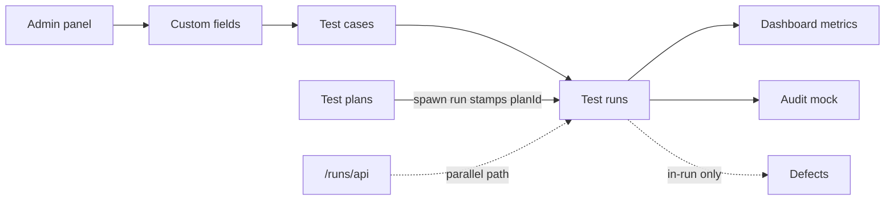

# Relay — Feature Flow Map

*Living document · Last verified: 9 July 2026 · Branch: `mvp-visual-overhaul`*

Product and implementation flow map for the team. Complements authoritative contracts in `docs/_authoritative/**` with journey-oriented status and test checklists.

**For developers and agents:** Update this file whenever routes, module status, persistence, or user journeys change. Pair with [`user-guide.md`](user-guide.md).

---

## Modules and routes

**Canonical pattern:** `/:projectKey/:moduleSlug` — project key is uppercase in URLs (e.g. `DP`, `CTMS`).

| Module | Slug | Screen component | Route(s) | Data state |
|--------|------|------------------|----------|------------|
| Dashboard | `dashboard` | `DashboardScreen` | `/:key/dashboard` | Live FreshProvider data (all projects) |
| My Work | `mywork` | `MyWorkScreen` | `/:key/mywork` | Static demo content |
| Test cases | `testcases` | `CasesScreen` | `/:key/testcases`, `/:key/testcases/tc/:caseKey` | Mock + localStorage |
| Test plans | `plans` | `PlansScreen` | `/:key/plans` | Mock seed |
| Test runs | `testruns` | `RunsScreen` | `/:key/testruns`, `/:key/testruns/tr/:runKey`, `/:key/testruns/tr/:runKey/tc/:caseKey` | Mock + localStorage |
| Milestones | `milestones` | `MilestonesScreen` | `/:key/milestones` | Static demo content |
| Requirements | `requirements` | `RequirementsScreen` | `/:key/requirements` | Live `requirementsById` when present; static demo list fallback |
| Defects | `defects` | `DefectsScreen` | `/:key/defects` | Mock + localStorage (local DEF-*) |
| Reports | `reports` | `ReportsScreen` | `/:key/reports` | Static demo content |
| AI Studio | `aistudio` | `AiStudioScreen` | `/:key/aistudio` | Static demo content (no real AI) |
| Settings | `settings` | redirect → `/admin` | `/:key/settings` | Redirect only (legacy route) |
| Integrations | `integrations` | `PlaceholderScreen` | `/:key/integrations` | Placeholder |
| Audit | `audit` | `AuditScreen` | `/:key/audit` | Static seed |
| Login | — | `LoginScreen` | `/:key/login` | Static demo page; **not** an auth gate |
| Admin | — | `AdminShell` + page content | `/admin`, `/admin/profile` … `/admin/audit-log` | Mock + localStorage |
| API runs | — | `ApiRunsWorkspace` | `/runs/api` | **API / MySQL** |

**Legacy unprefixed redirects** (`LegacyRouteRedirect`): `/dashboard`, `/cases`, `/runs`, `/plans`, etc. → `/:activeProjectKey/<module>`.

**Root:** `/` → `/DP/dashboard`.

**Exceptions:** `/runs/api`, `/api/*` — not project-prefixed.

**Route helpers:** `apps/web/src/fresh/lib/project-routes.ts`  
**Machine-readable metadata:** `apps/web/src/lib/relay/prototype-contracts.ts`

**Known route gap:** `/:key/cases` → **404** (slug renamed to `testcases`; unprefixed `/cases` still redirects).

---

## Main user journeys

### 1. First-time demo (no Docker)

```
/ → /DP/dashboard → browse testcases → open testruns/tr/00001 → execute case → seal run
```

### 2. Create and execute a new run

```
/:key/testcases (optional: select cases)
  → Create test run OR /:key/testruns → Create run modal
  → /:key/testruns/tr/:runKey
  → + Add cases (if empty)
  → select case → mark step/case results
  → Close test run (seal)
```

### 3. Manage test library

```
/:key/testcases
  → folder navigation → quick create / new case modal
  → row ⋯ menu (duplicate, edit, delete)
  → detail panel edit → persists localStorage
```

### 4. Multi-project workflow

```
ProjectSwitcher → select / create / add demo project
  → URL rewrites (/:oldKey/module → /:newKey/module)
  → scoped folders, cases, runs per project
```

### 5. Admin configuration

```
/admin/projects → select project → activate custom fields
/admin/custom-fields → define fields globally
/admin/users → invite user (localStorage)
Changes append to /admin/audit-log
```

### 6. API validation path (backend slice)

```
pnpm docker:up && pnpm db:migrate && pnpm db:seed
→ /runs/api → create run → update case result
→ pnpm api:validate
```

Demo `/DP/testruns` and `/runs/api` are **intentionally separate** until wiring slice.

---

## Data persistence model

| Layer | Mechanism | Scope |
|-------|-----------|-------|
| Prototype UI | `FreshProvider` + `useReducer` | In-memory React state |
| Browser persistence | `localStorage` key **`relay-demo-v2`** | Survives refresh; per browser |
| Demo seed | `buildInitialDemoState()`, `demo-template.ts`, `seed.ts` | Initial load + “Add demo project” clone |
| API workspace | MySQL via `/api/runs/*` | `/runs/api` only |
| Static mock | `mock-data.ts`, seed arrays | Defects TI-* rows, plan list, project audit |

**Not persisted in prototype:** test plans (seed only), project-level audit timeline, defects module data, reports/integrations placeholders.

**Active project sync:** `ProjectRouteSync` reads URL project key → `setActiveProject`. Switcher writes URL + state together.

---

## localStorage schema notes

| Field | Value |
|-------|-------|
| Key | `relay-demo-v2` |
| Current version | **`14`** (`DEMO_SCHEMA_VERSION` in `demo-model.ts`) |
| Migration file | `migrate-demo-state.ts` |
| On failure | Reset to seed (`buildInitialDemoState()`) |

### Version history (summary)

| Ver | Change |
|-----|--------|
| v2 | Multi-project blob |
| v3 | Required project `key`, Demo Project / `DP` |
| v4 | `runKey`, URL `/testruns/tr/:runKey` |
| v5 | `adminSettings` (global admin panel) |
| v6 | `Project.activeCustomFieldIds` |
| v7 | Case `template`, `references`, `summary`, `customFieldValues` |
| v8 | `Case.caseKey`, `nextCaseNumByProject` |
| v9 | Globally unique case ids (`newId('case')`) |
| v10 | `executionLog`, execution metadata on runs |
| v11 | `Case.createdAt` |
| v12 | `currentActorUserId`, user access fields, role permissions, silent invite statuses |
| v13 | `plansById`, `nextPlanNumByProject`, `TestPlan`/`TestQuery`/`QueryCondition` types, seed plans |
| v14 | `requirementsById`, `defectsById`, `Case.requirementIds`, `nextRequirementNumByProject`, `nextDefectNumByProject`, local REQ/DEF keys |

**Rule:** bump `DEMO_SCHEMA_VERSION` and add a migration step for every shape change.

**Key state fields:** `projectsById`, `activeProjectId`, `folders`, `cases`, `runs`, `currentRunIdByProject`, `nextRunNumByProject`, `nextCaseNumByProject`, `adminSettings`, `currentActorUserId`, `plansById`, `nextPlanNumByProject`, `requirementsById`, `defectsById`, `nextRequirementNumByProject`, `nextDefectNumByProject`.

Detail: [`docs/_authoritative/DOMAIN_MODEL.md`](../_authoritative/DOMAIN_MODEL.md), [`docs/claude/handoff.md`](../claude/handoff.md).

---

## Role / RBAC behaviour

### Target (backend — documented, not enforced in demo UI)

| Role | Capability (summary) |
|------|------------------------|
| `super_admin` | Platform-wide management |
| `admin` | Project management, seal/reopen runs |
| `contributor` | Execute runs, edit cases |
| `viewer` | Read-only |

Project-level override: `MAX(global_role, project_role)`.

Source: [`docs/_authoritative/ARCHITECTURE_BASELINE.md`](../_authoritative/ARCHITECTURE_BASELINE.md) § RBAC.

### Prototype today

| Area | Behaviour |
|------|-----------|
| Admin users/roles UI | Seed + CRUD in localStorage; audit log on mutations |
| Demo screens | **No role checks** — all actions available |
| Seal / reopen run | UI toggle only; no admin gate |
| `/runs/api` | Dev header `x-relay-user-id` / `NEXT_PUBLIC_RELAY_USER_ID`; service-layer RBAC on mutations |

---

## Feature status table

| Module / feature | Status | Persistence | Notes |
|------------------|--------|-------------|-------|
| Shell & navigation | **Implemented** | Client | Sidebar (Testing/Traceability groups), global top bar (New test case/run, AI Studio, Notifications, Help), Cmd+K; Pinned Modules and Integrations nav removed |
| Project switcher & CRUD | **Implemented** | localStorage | URL sync; cascade delete |
| Dashboard | **Implemented** | localStorage | Phase 2 layout: KPI strip, completion donut, results-over-time chart, assignee bars, open runs, milestones slice, needs attention; live selectors |
| Test cases — tree & table | **Implemented** | localStorage | Filters, pagination, search |
| Test cases — detail & CRUD | **Implemented** | localStorage | Tabs, custom fields, context menu |
| Test cases — URL sync | **Implemented** | — | `/testcases/tc/:caseKey` |
| Test plans — list & detail | **Implemented** | localStorage | URL routing; CRUD modals; Overview + Test cases tabs |
| Test plans — test case query groups | **Implemented** | localStorage | Condition/folder/static; live resolved-case preview |
| Test plans — spawn run | **Implemented** | localStorage | Modal pre-fills title + count; stamps planId on run |
| Test runs — list & picker | **Implemented** | localStorage | Search, archive hide |
| Test runs — create / edit / duplicate / delete | **Implemented** | localStorage | |
| Test runs — add cases to run | **Implemented** | localStorage | `AddCasesToRunModal` |
| Test runs — empty state | **Implemented** | — | Testiny-style |
| Test runs — execution UX | **Implemented** | localStorage | Steps, results, shortcuts |
| Test runs — seal / reopen | **Implemented** | localStorage | No RBAC gate |
| Test runs — URL sync | **Implemented** | — | `/tr/:runKey`, `/tc/:caseKey` |
| Test cases — requirements create/link | **Implemented** | localStorage | Requirements tab; REQ-* keys |
| Test cases — defects view-only | **Implemented** | localStorage | Derived from run execution links |
| Test runs — requirements view-only | **Implemented** | localStorage | From linked case requirements |
| Defects module screen | **Partial** | Mock + localStorage | Table toolbar + detail panel; static TI-* + local DEF-*; create disabled |
| Defects in-run create/link | **Implemented** | localStorage | Failed/Blocked + unsealed only |
| Reports | **Placeholder** | — | Static demo content |
| Integrations (project) | **Placeholder** | — | Route exists; sidebar link removed |
| Settings (project) | **Redirect** | — | `/:key/settings` → `/admin`; sidebar "Project Settings" entry |
| Audit (project) | **Partial** | Static seed | Page header + filter chips + event rows |
| Admin panel (all sections) | **Implemented** | localStorage | 11 routes under `/admin` |
| Admin — user management | **Implemented** | localStorage | Invite, silent invite, edit, disable/reactivate, project access |
| Admin — role management | **Implemented** | localStorage | Built-in + custom roles, permission matrix |
| Admin — demo actor / RBAC | **Partial** | localStorage | Enforced on admin user/role actions only |
| RBAC enforcement (project UI) | **Missing** | — | Test runs / cases not gated |
| Demo UI → MySQL wiring | **Missing** | — | Use `/runs/api` separately |
| Global search (OpenSearch) | **Missing** | — | Cmd+K is in-memory |
| Export PDF/CSV | **Missing** | — | Buttons are visual |
| Requirements / traceability | **Partial** | localStorage | Local create/link on cases; no coverage dashboards |

---

## Dependencies between modules



| Dependency | Detail |
|------------|--------|
| Admin → Test cases | `activeCustomFieldIds` controls which custom fields render |
| Test cases → Test runs | Cases referenced in `run.caseOrder`; create-run from cases toolbar |
| Test plans → Test runs | Spawn run creates a run with `planId`/`planName` stamped; plan's query groups resolve case list for scope display |
| Test runs → Dashboard | Run cards, metrics, attention, and coverage derive from active run/case state |
| Project scope | All case/run/folder selectors filter by `activeProjectId` |
| Schema migrations | Any model change affects all modules using `FreshProvider` |

---

## Known limitations

- Frontend-only phase — no demo UI API wiring ([`MVP_FRONTEND_ONLY_SCOPE.md`](../_authoritative/MVP_FRONTEND_ONLY_SCOPE.md))
- `/DP/cases` 404; use `/DP/testcases`
- Run spawn does not snapshot case steps immutably (edits affect same case objects)
- `/:key/integrations` placeholder not in sidebar
- CasesScreen project-switch flicker (BUG-02) — deferred
- Authoritative docs may lag code ([`AS_BUILT_SNAPSHOT.md`](../_authoritative/AS_BUILT_SNAPSHOT.md) still references `/cases` slug in places)

---

## Future backend / API requirements

| Module | Expected APIs (minimum) |
|--------|-------------------------|
| Auth | Session, SSO, user context |
| Projects | CRUD, membership, role assignment |
| Test cases | CRUD, folders, steps, bulk import |
| Test plans | CRUD, spawn run |
| Test runs | CRUD, seal, snapshot cases, case/step results |
| Defects | CRUD, case/run linking, external refs |
| Audit | Read paginated log; existing write path |
| Dashboard | Aggregates from runs + defects |
| Reports | Generation + export |
| Search | OpenSearch fan-out (cases, runs, plans) |

Per-screen detail: [`FRONTEND_CONTRACTS.md`](../_authoritative/FRONTEND_CONTRACTS.md).

---

## Manual test checklist per module

### Dashboard — `/:key/dashboard`

- [ ] KPI strip shows Executed %, Passed, Failed, Blocked, Open runs, pass-trend sparkline from live data
- [ ] Completion donut + legend; lowest-coverage-by-folder rows when applicable
- [ ] Results-over-time chart renders; 7d / 30d / 90d chips switch window
- [ ] Results-by-assignee bars populate for executed cases
- [ ] Open test runs list links through to `/testruns/tr/:runKey`
- [ ] Milestones slice renders static placeholders with link to `/milestones`
- [ ] Needs attention lists unlinked failures; rows link to test runs
- [ ] New blank project (zero cases) shows “Add your first test cases” empty state
- [ ] Trend/delta panels show flat “as of today” / snapshot note when seed has no dated `executionLog`
- [ ] No console errors on load

### Test cases — `/:key/testcases`

- [ ] Folder expand/collapse and folder search
- [ ] Case-list pane toolbar shows Create test run, Import, Quick create, New case (not in global top bar)
- [ ] Quick create and New case modal persist after refresh
- [ ] Row ⋯ menu: duplicate, edit, delete
- [ ] Detail panel ← → navigation and URL `/tc/:caseKey`
- [ ] Filter panel and keyword search
- [ ] Create test run from case-list toolbar
- [ ] Project switch → cases scoped to new project
- [ ] Legacy `/cases` redirects to `/:key/testcases`

### Test plans — `/:key/plans`

- [ ] Plan list renders; row select navigates to `/plans/tp/:planKey`
- [ ] Create plan modal — saves and selects new plan
- [ ] Edit plan modal — updates title/description
- [ ] Duplicate plan — copies with incremented key
- [ ] Delete plan — removes from list
- [ ] Overview tab — three cards (details, open run, coverage %); run history table
- [ ] Test cases tab — add condition/folder/static query groups; live resolved-case preview updates
- [ ] Spawn run modal — shows case count, pre-fills title, creates run, navigates to testruns
- [ ] Project switch clears plan selection; URL updates correctly

### Test runs — `/:key/testruns`

- [ ] Global top bar shows New test case, New test run, AI Studio, Notifications, Help on this screen too
- [ ] Page-head shows Close/Re-open, Edit, Report, More… (not in global top bar)
- [ ] Create run modal → navigates to `/tr/:runKey`
- [ ] Empty run shows empty state; Add cases modal works
- [ ] Run picker search and switch updates URL
- [ ] Step and case result buttons; sealed run blocks edits
- [ ] Duplicate and delete run
- [ ] Deep link `/tr/:runKey/tc/:caseKey`
- [ ] Project switch strips run selection; no flicker (RunsScreen)
- [ ] Legacy `/runs` redirects

### Defects — `/:key/defects`

- [ ] Toolbar: All defects, shown count, search, severity filter, status chips, Details toggle
- [ ] Table rows select defect; detail panel opens/closes
- [ ] Local DEF-* rows appear with TI-* mock data
- [ ] New defect button disabled

### Settings — `/:key/settings`

- [ ] Visiting `/:key/settings` redirects to `/admin`
- [ ] Sidebar shows single **Project Settings** entry (not separate Settings + Admin links)

### Reports / Integrations — `/:key/reports`, `/:key/integrations`

- [ ] Reports: chip tabs render (Run Summary default); Export disabled
- [ ] Integrations: placeholder banner and message

### My Work — `/:key/mywork`

- [ ] KPI strip and test queue / defects panels render
- [ ] Continue/Run links navigate to test runs (no real assignment logic)

### Milestones — `/:key/milestones`

- [ ] Milestone cards with progress bars and linked runs render

### Requirements (list view) — `/:key/requirements`

- [ ] Table lists requirements (live data or static fallback)
- [ ] Read-only — no create/edit on this page

### AI Studio — `/:key/aistudio`

- [ ] Prompt row, quick actions, draft preview render
- [ ] Generate/Accept/Edit/Discard are non-functional demo controls

### Login — `/:key/login`

- [ ] Full-bleed login layout renders; Sign In / SSO navigate to dashboard
- [ ] Does not gate app entry; `/` still goes to dashboard

### Audit — `/:key/audit`

- [ ] Page header (title, subtitle, Export CSV) renders
- [ ] Filter chips toggle client-side (All events / Test Cases / Test Runs / Test Plans / Users)
- [ ] Event rows show icon chips, descriptions with ref links, timestamps

### Admin — `/admin/users`, `/admin/roles`

- [ ] Actor switcher: Owner can invite/edit/disable users
- [ ] Switch to Editor — invite button shows permission message
- [ ] Switch to Viewer — user management page read-only/denied
- [ ] Silent invite creates **Silent created** status; normal invite → **Pending invite**
- [ ] Role view shows built-in permission matrix (read-only)
- [ ] Create custom role with permissions; edit and delete
- [ ] Audit log records invite, edit, disable, role CRUD, actor switch

### API workspace — `/runs/api` (optional)

- [ ] Requires Docker + seed
- [ ] Create run; update case result
- [ ] `pnpm api:validate` passes

---

## Mandatory post-change smoke test (agents)

After every user-visible feature change, route change, schema/localStorage change, RBAC change, or module flow change, agents must:

1. Run `pnpm build`
2. Start `pnpm dev`
3. Browser smoke test affected routes **and** core regression routes (below)
4. Record WebM evidence where tooling supports it
5. Capture screenshots for failures
6. Write `/tmp/relay-qa-<branch-or-feature>/qa-report.md` with pass/fail summary, bugs, known limitations, push readiness
7. Do not push until evidence is reviewed or explicitly waived

Evidence lives under `/tmp/relay-qa-...` (not committed). Temporary Playwright scripts under `/tmp/` are fine; do not add permanent test dependencies in feature PRs unless already present.

**Core regression routes:** `/admin/users`, `/admin/roles`, `/admin/audit-log`, `/DP/settings`, `/DP/dashboard`, `/DP/testcases`, `/DP/testruns`, `/DP/plans`

**Admin / RBAC smoke behaviours:** user table load; silent invite → Silent created; normal invite → Pending invite; edit/disable/reactivate; final Owner/Admin guard; actor switcher; Editor/Viewer blocked; built-in roles + custom CRUD; audit entries; refresh preserves localStorage v12.

**Project smoke behaviours:** testcases/testruns/plans load; create/open run and add cases; project switch without flicker (when switcher available).

---

## Related documentation

| Doc | Role |
|-----|------|
| [`user-guide.md`](user-guide.md) | User-facing how-to |
| [`ux-philosophy.md`](ux-philosophy.md) | UX rationale (stable reference) |
| [`design-system.md`](design-system.md) | Visual tokens |
| [`changelog.md`](changelog.md) | Release history |
| [`docs/_authoritative/*`](../_authoritative/README.md) | Contracts and as-built truth |
| [`docs/claude/handoff.md`](../claude/handoff.md) | Active branch and schema session state |
