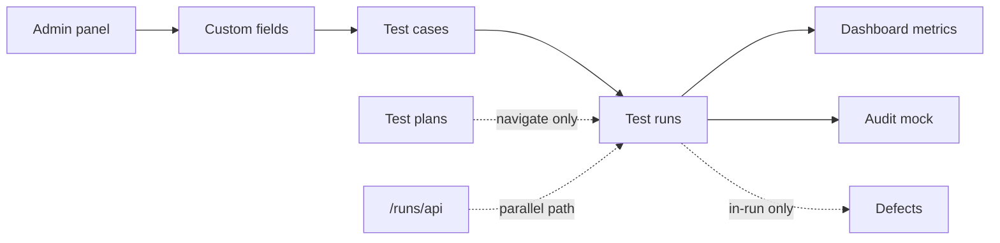

# Relay — Feature Flow Map

*Living document · Last verified: June 2026 · Branch: `mvp-user-role-access`*

Product and implementation flow map for the team. Complements authoritative contracts in `docs/_authoritative/**` with journey-oriented status and test checklists.

**For developers and agents:** Update this file whenever routes, module status, persistence, or user journeys change. Pair with [`user-guide.md`](user-guide.md).

---

## Modules and routes

**Canonical pattern:** `/:projectKey/:moduleSlug` — project key is uppercase in URLs (e.g. `DP`, `CTMS`).

| Module | Slug | Screen component | Route(s) | Data state |
|--------|------|------------------|----------|------------|
| Dashboard | `dashboard` | `DashboardScreen` | `/:key/dashboard` | Mock seed (demo template only) |
| Test cases | `testcases` | `CasesScreen` | `/:key/testcases`, `/:key/testcases/tc/:caseKey` | Mock + localStorage |
| Test plans | `plans` | `PlansScreen` | `/:key/plans` | Mock seed |
| Test runs | `testruns` | `RunsScreen` | `/:key/testruns`, `/:key/testruns/tr/:runKey`, `/:key/testruns/tr/:runKey/tc/:caseKey` | Mock + localStorage |
| Defects | `defects` | `DefectsScreen` | `/:key/defects` | Static mock |
| Settings | `settings` | `SettingsScreen` | `/:key/settings` | Static mock (read-only) |
| Reports | `reports` | `PlaceholderScreen` | `/:key/reports` | Placeholder |
| Integrations | `integrations` | `PlaceholderScreen` | `/:key/integrations` | Placeholder |
| Audit | `audit` | `AuditScreen` | `/:key/audit` | Static seed |
| Admin | — | `AdminShell` + page content | `/admin`, `/admin/profile` … `/admin/audit-log` | Mock + localStorage |
| API runs | — | `ApiRunsWorkspace` | `/runs/api` | **API / MySQL** |

**Legacy unprefixed redirects** (`LegacyRouteRedirect`): `/dashboard`, `/cases`, `/runs`, `/plans`, etc. → `/:activeProjectKey/<module>`.

**Root:** `/` → `/DP/dashboard`.

**Exceptions:** `/runs/api`, `/api/*` — not project-prefixed.

**Route helpers:** `apps/web/src/fresh/lib/project-routes.ts`  
**Machine-readable metadata:** `apps/web/src/lib/relay/prototype-contracts.ts`

**Known route gap:** `/:key/cases` → **404** (slug renamed to `testcases`; unprefixed `/cases` still redirects).

---

## Main user journeys

### 1. First-time demo (no Docker)

```
/ → /DP/dashboard → browse testcases → open testruns/tr/00001 → execute case → seal run
```

### 2. Create and execute a new run

```
/:key/testcases (optional: select cases)
  → Create test run OR /:key/testruns → Create run modal
  → /:key/testruns/tr/:runKey
  → + Add cases (if empty)
  → select case → mark step/case results
  → Close test run (seal)
```

### 3. Manage test library

```
/:key/testcases
  → folder navigation → quick create / new case modal
  → row ⋯ menu (duplicate, edit, delete)
  → detail panel edit → persists localStorage
```

### 4. Multi-project workflow

```
ProjectSwitcher → select / create / add demo project
  → URL rewrites (/:oldKey/module → /:newKey/module)
  → scoped folders, cases, runs per project
```

### 5. Admin configuration

```
/admin/projects → select project → activate custom fields
/admin/custom-fields → define fields globally
/admin/users → invite user (localStorage)
Changes append to /admin/audit-log
```

### 6. API validation path (backend slice)

```
pnpm docker:up && pnpm db:migrate && pnpm db:seed
→ /runs/api → create run → update case result
→ pnpm api:validate
```

Demo `/DP/testruns` and `/runs/api` are **intentionally separate** until wiring slice.

---

## Data persistence model

| Layer | Mechanism | Scope |
|-------|-----------|-------|
| Prototype UI | `FreshProvider` + `useReducer` | In-memory React state |
| Browser persistence | `localStorage` key **`relay-demo-v2`** | Survives refresh; per browser |
| Demo seed | `buildInitialDemoState()`, `demo-template.ts`, `seed.ts` | Initial load + “Add demo project” clone |
| API workspace | MySQL via `/api/runs/*` | `/runs/api` only |
| Static mock | `mock-data.ts`, seed arrays | Defects, settings preview, plan list, project audit |

**Not persisted in prototype:** test plans (seed only), project-level audit timeline, defects module data, reports/integrations placeholders.

**Active project sync:** `ProjectRouteSync` reads URL project key → `setActiveProject`. Switcher writes URL + state together.

---

## localStorage schema notes

| Field | Value |
|-------|-------|
| Key | `relay-demo-v2` |
| Current version | **`12`** (`DEMO_SCHEMA_VERSION` in `demo-model.ts`) |
| Migration file | `migrate-demo-state.ts` |
| On failure | Reset to seed (`buildInitialDemoState()`) |

### Version history (summary)

| Ver | Change |
|-----|--------|
| v2 | Multi-project blob |
| v3 | Required project `key`, Demo Project / `DP` |
| v4 | `runKey`, URL `/testruns/tr/:runKey` |
| v5 | `adminSettings` (global admin panel) |
| v6 | `Project.activeCustomFieldIds` |
| v7 | Case `template`, `references`, `summary`, `customFieldValues` |
| v8 | `Case.caseKey`, `nextCaseNumByProject` |
| v9 | Globally unique case ids (`newId('case')`) |
| v10 | `executionLog`, execution metadata on runs |
| v11 | `Case.createdAt` |
| v12 | `currentActorUserId`, user access fields, role permissions, silent invite statuses |

**Rule:** bump `DEMO_SCHEMA_VERSION` and add a migration step for every shape change.

**Key state fields:** `projectsById`, `activeProjectId`, `foldersById`, `casesById`, `runsById`, `currentRunIdByProject`, `nextRunNumByProject`, `nextCaseNumByProject`, `adminSettings`, `currentActorUserId`.

Detail: [`docs/_authoritative/DOMAIN_MODEL.md`](../_authoritative/DOMAIN_MODEL.md), [`docs/claude/handoff.md`](../claude/handoff.md).

---

## Role / RBAC behaviour

### Target (backend — documented, not enforced in demo UI)

| Role | Capability (summary) |
|------|------------------------|
| `super_admin` | Platform-wide management |
| `admin` | Project management, seal/reopen runs |
| `contributor` | Execute runs, edit cases |
| `viewer` | Read-only |

Project-level override: `MAX(global_role, project_role)`.

Source: [`docs/_authoritative/ARCHITECTURE_BASELINE.md`](../_authoritative/ARCHITECTURE_BASELINE.md) § RBAC.

### Prototype today

| Area | Behaviour |
|------|-----------|
| Admin users/roles UI | Seed + CRUD in localStorage; audit log on mutations |
| Demo screens | **No role checks** — all actions available |
| Seal / reopen run | UI toggle only; no admin gate |
| `/runs/api` | Dev header `x-relay-user-id` / `NEXT_PUBLIC_RELAY_USER_ID`; service-layer RBAC on mutations |

---

## Feature status table

| Module / feature | Status | Persistence | Notes |
|------------------|--------|-------------|-------|
| Shell & navigation | **Implemented** | Client | Sidebar, module switcher, Cmd+K |
| Project switcher & CRUD | **Implemented** | localStorage | URL sync; cascade delete |
| Dashboard (demo template) | **Implemented** | Seed | Metrics for `seedTemplate: 'demo'` only |
| Dashboard (other projects) | **Placeholder** | — | “Coming soon” |
| Test cases — tree & table | **Implemented** | localStorage | Filters, pagination, search |
| Test cases — detail & CRUD | **Implemented** | localStorage | Tabs, custom fields, context menu |
| Test cases — URL sync | **Implemented** | — | `/testcases/tc/:caseKey` |
| Test plans — list & detail | **Partial** | Seed | View only; no edit |
| Test plans — spawn run | **Partial** | — | Navigates to testruns; no auto-create |
| Test runs — list & picker | **Implemented** | localStorage | Search, archive hide |
| Test runs — create / edit / duplicate / delete | **Implemented** | localStorage | |
| Test runs — add cases to run | **Implemented** | localStorage | `AddCasesToRunModal` |
| Test runs — empty state | **Implemented** | — | Testiny-style |
| Test runs — execution UX | **Implemented** | localStorage | Steps, results, shortcuts |
| Test runs — seal / reopen | **Implemented** | localStorage | No RBAC gate |
| Test runs — URL sync | **Implemented** | — | `/tr/:runKey`, `/tc/:caseKey` |
| Defects module screen | **Partial** | Static mock | Create disabled |
| Defects in-run linking | **Partial** | In-memory | Not synced to defects screen |
| Reports | **Placeholder** | — | |
| Integrations (project) | **Placeholder** | — | |
| Settings (project) | **Partial** | Static mock | Read-only |
| Audit (project) | **Partial** | Static seed | |
| Admin panel (all sections) | **Implemented** | localStorage | 11 routes under `/admin` |
| Admin — user management | **Implemented** | localStorage | Invite, silent invite, edit, disable/reactivate, project access |
| Admin — role management | **Implemented** | localStorage | Built-in + custom roles, permission matrix |
| Admin — demo actor / RBAC | **Partial** | localStorage | Enforced on admin user/role actions only |
| RBAC enforcement (project UI) | **Missing** | — | Test runs / cases not gated |
| Demo UI → MySQL wiring | **Missing** | — | Use `/runs/api` separately |
| Global search (OpenSearch) | **Missing** | — | Cmd+K is in-memory |
| Export PDF/CSV | **Missing** | — | Buttons are visual |
| Requirements / traceability | **Missing** | — | |

---

## Dependencies between modules



| Dependency | Detail |
|------------|--------|
| Admin → Test cases | `activeCustomFieldIds` controls which custom fields render |
| Test cases → Test runs | Cases referenced in `run.caseOrder`; create-run from cases toolbar |
| Test plans → Test runs | Spawn link navigates; no data coupling in state |
| Test runs → Dashboard | Run cards read seed metrics, not live run state |
| Project scope | All case/run/folder selectors filter by `activeProjectId` |
| Schema migrations | Any model change affects all modules using `FreshProvider` |

---

## Known limitations

- Frontend-only phase — no demo UI API wiring ([`MVP_FRONTEND_ONLY_SCOPE.md`](../_authoritative/MVP_FRONTEND_ONLY_SCOPE.md))
- `/DP/cases` 404; use `/DP/testcases`
- Plans not in `DemoState` — cannot reflect user-created cases
- Run spawn does not snapshot case steps immutably (edits affect same case objects)
- Project settings in switcher disabled
- CasesScreen project-switch flicker (BUG-02) — deferred
- Authoritative docs may lag code ([`AS_BUILT_SNAPSHOT.md`](../_authoritative/AS_BUILT_SNAPSHOT.md) still references `/cases` slug in places)

---

## Future backend / API requirements

| Module | Expected APIs (minimum) |
|--------|-------------------------|
| Auth | Session, SSO, user context |
| Projects | CRUD, membership, role assignment |
| Test cases | CRUD, folders, steps, bulk import |
| Test plans | CRUD, spawn run |
| Test runs | CRUD, seal, snapshot cases, case/step results |
| Defects | CRUD, case/run linking, external refs |
| Audit | Read paginated log; existing write path |
| Dashboard | Aggregates from runs + defects |
| Reports | Generation + export |
| Search | OpenSearch fan-out (cases, runs, plans) |

Per-screen detail: [`FRONTEND_CONTRACTS.md`](../_authoritative/FRONTEND_CONTRACTS.md).

---

## Manual test checklist per module

### Dashboard — `/:key/dashboard`

- [ ] Demo project shows run cards and attention list
- [ ] Non-demo project shows placeholder
- [ ] *New Run* / attention links open testruns
- [ ] No console errors on load

### Test cases — `/:key/testcases`

- [ ] Folder expand/collapse and folder search
- [ ] Quick create and New case modal persist after refresh
- [ ] Row ⋯ menu: duplicate, edit, delete
- [ ] Detail panel ← → navigation and URL `/tc/:caseKey`
- [ ] Filter panel and keyword search
- [ ] Create test run from toolbar
- [ ] Project switch → cases scoped to new project
- [ ] Legacy `/cases` redirects to `/:key/testcases`

### Test plans — `/:key/plans`

- [ ] Plan list selects and shows detail tabs
- [ ] Spawn link navigates to testruns

### Test runs — `/:key/testruns`

- [ ] Create run modal → navigates to `/tr/:runKey`
- [ ] Empty run shows empty state; Add cases modal works
- [ ] Run picker search and switch updates URL
- [ ] Step and case result buttons; sealed run blocks edits
- [ ] Duplicate and delete run
- [ ] Deep link `/tr/:runKey/tc/:caseKey`
- [ ] Project switch strips run selection; no flicker (RunsScreen)
- [ ] Legacy `/runs` redirects

### Defects — `/:key/defects`

- [ ] Table and detail panel render
- [ ] New defect button disabled

### Settings — `/:key/settings`

- [ ] Read-only fields display

### Reports / Integrations — `/:key/reports`, `/:key/integrations`

- [ ] Placeholder banner and message

### Audit — `/:key/audit`

- [ ] Timeline renders; filter chips toggle (client-side)

### Admin — `/admin/users`, `/admin/roles`

- [ ] Actor switcher: Owner can invite/edit/disable users
- [ ] Switch to Editor — invite button shows permission message
- [ ] Switch to Viewer — user management page read-only/denied
- [ ] Silent invite creates **Silent created** status; normal invite → **Pending invite**
- [ ] Role view shows built-in permission matrix (read-only)
- [ ] Create custom role with permissions; edit and delete
- [ ] Audit log records invite, edit, disable, role CRUD, actor switch

### API workspace — `/runs/api` (optional)

- [ ] Requires Docker + seed
- [ ] Create run; update case result
- [ ] `pnpm api:validate` passes

---

## Related documentation

| Doc | Role |
|-----|------|
| [`user-guide.md`](user-guide.md) | User-facing how-to |
| [`ux-philosophy.md`](ux-philosophy.md) | UX rationale (stable reference) |
| [`design-system.md`](design-system.md) | Visual tokens |
| [`changelog.md`](changelog.md) | Release history |
| [`docs/_authoritative/*`](../_authoritative/README.md) | Contracts and as-built truth |
| [`docs/claude/handoff.md`](../claude/handoff.md) | Active branch and schema session state |
